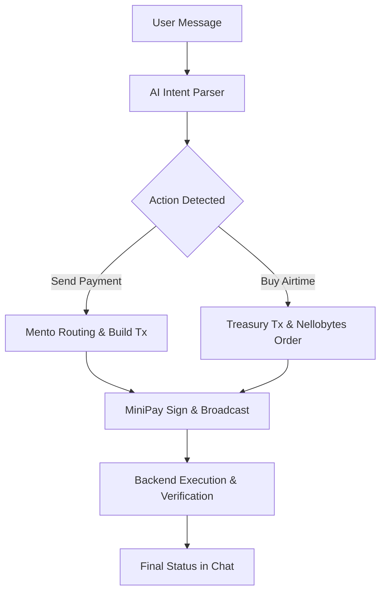

# 💰 RonPay


> **Hackathon Note:** We were unable to verify ourselves from Nigeria during the testing period. Please consider this when reviewing the live demo.

> **AI-Powered Financial Freedom for Africa.** Send money, buy airtime, and pay bills using natural language within MiniPay.

[](https://celo.org)
[](https://www.opera.com/minipay)
[](LICENSE)

---

## 🌟 What is RonPay?

RonPay is an intelligent payment agent built for the next generation of mobile users in Africa. By combining the power of **Large Language Models (LLMs)** with the **Celo Blockchain**, we've removed the complexity of decentralized finance.

No more copying long wallet addresses or calculating exchange rates manually. Just tell RonPay what you want to do.

```text
You: "Buy 1000 Naira MTN airtime for 08142293610"
RonPay: "✅ Got it! I've prepared your ₦1,000 airtime purchase for 0.67 USDm. Click confirm to sign."
```

## 🚀 Key Features

### 💬 Natural Language Intelligence

Powered by **Google Gemini 2.0** and **Claude 3.5**, RonPay parses your intent instantly.

- **Multilingual**: Supports English, French, Spanish, and Portuguese.
- **Intent Detection**: Automatically distinguishes between P2P transfers, airtime purchases, and bill payments.

### ⚡ Instant Cross-Border Remittance

- **Mento Protocol Integration**: Uses real-time stabilized exchange rates for USDm, NGNm, KESm, BRLm, and EURm.
- **Ultra-Low Fees**: Save up to 95% compared to traditional remittance services.
- **Direct signing**: Sign and send in seconds using MiniPay's injected wallet.

### � Utility & Bill Payments

- **Airtime & Data**: Instant top-up for MTN, Airtel, Glo, and 9mobile via **Nellobytes integration**.
- **Automated Verification**: Backend validates blockchain receipts before triggering utility fulfillment.
- **Bill Auto-Pay**: (Beta) Pay for electricity and TV subscriptions using natural language commands.

### � Smart Financial Management

- **Balance Tracking**: "Check my USDm balance" or "Show me my NGNm holdings".
- **Real-time Timestamps**: Every message is tracked with live timestamps for better transaction logging.
- **Default Country Localization**: Pre-configured for the Nigerian market with 🇳🇬 Nigeria as the default country.

## 🛠️ Tech Stack

- **Frontend**:
  - [Next.js](https://nextjs.org/) (React)
  - [Wagmi](https://wagmi.sh/) & [Viem](https://viem.sh/) (Celo/Blockchain interaction)
  - [Lucide React](https://lucide.dev/) (Icons)
  - [Tailwind CSS](https://tailwindcss.com/) (Styling)
- **Backend**:
  - [NestJS](https://nestjs.com/) (Node.js framework)
  - [TypeORM](https://typeorm.io/) (Database mapping)
  - [Viem](https://viem.sh/) (Blockchain verification)
- **AI/LLM**:
  - Google Gemini 2.0 API
  - Anthropic Claude 3.5 API
- **Infrastructure**:
  - [Mento Protocol](https://mento.org/) (Exchange rates)
  - [Nellobytes](https://www.nellobytesystems.com/) (Utility API)
  - [Celo Blockchain](https://celo.org/) (Settlement Layer)

## 🏗️ Architecture



## 📂 Project Structure

```text
ronpay/
├── Frontend/           # Next.js web application
│   ├── apps/web/       # Main chat interface
│   └── components/     # UI & Payment components
├── backend/            # NestJS API & Oracle
│   ├── src/ai/         # Gemini & Claude prompt logic
│   ├── src/blockchain/ # Celo & Mento integration
│   ├── src/nellobytes/ # Airtime fulfillment logic
│   └── src/payments/   # Transaction lifecycle management
└── scripts/            # Debugging & maintenance tools
```

## 🛣️ Roadmap

### ✅ Phase 1: Foundation (Current)

- [x] AI Intent Parsing (Gemini/Claude)
- [x] MiniPay Wallet Integration
- [x] Mento Protocol Cross-Currency Routing
- [x] Airtime Purchase Flow (Nellobytes)
- [x] Real-time Transaction Verification

### 🚧 Phase 2: Growth (Q2 2026)

- [ ] Multi-Step Recurring Payments
- [ ] ODIS Phone Number Resolution (Send money to phone contacts)
- [ ] WhatsApp & Telegram Bot Interface
- [ ] Expanded Bill Payments (Electricity, Water, TV)

### 🔮 Phase 3: Scaling (Q3 2026+)

- [ ] Merchant API for RonPay
- [ ] Voice Command Support
- [ ] 10+ New African Markets (Ghana, Kenya, Rwanda, etc.)

## 🤝 Contributing

We welcome contributions! Please see our contributing guidelines or open an issue for discussion.

## 📄 License

Distributed under the MIT License. See `LICENSE` for more information.

---

Built with ❤️ for the Celo Ecosystem.
