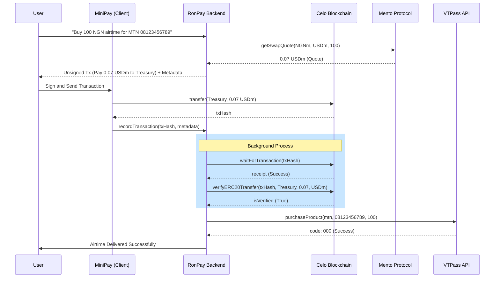

# Airtime Purchase Flow

This document outlines the end-to-end process of purchasing airtime using RonPay.

## Sequence Diagram

## Function-by-Function Breakdown

### 1. Intent Parsing
- **`PaymentsService.parsePaymentIntent`**: Entry point for natural language.
- **`PaymentsService.handleVtpassIntent`**:
    - Converts NGN amount to USDm using `MentoService`.
    - Builds the treasury payment transaction using `CeloService`.
    - Returns metadata (provider, recipient, NGN amount) to the client.

### 2. Transaction Recording & Monitoring
- **`PaymentsService.recordTransaction`**:
    - Stores the transaction in the database (status: `pending`).
    - Starts background monitoring of the `txHash`.

### 3. Verification & Fulfillment
- **`CeloService.verifyERC20Transfer`**:
    - Scans transaction logs to confirm tokens were received at the treasury.
- **`VtpassService.purchaseProduct`**:
    - Sends the final order to VTPass API.
    - **Mapped Service IDs**: MTN (`mtn`), Airtel (`airtel`), Glo (`glo`), 9mobile (`etisalat`).
    - **Payload**: Ensures `variation_code` is omitted for airtime to avoid errors.
